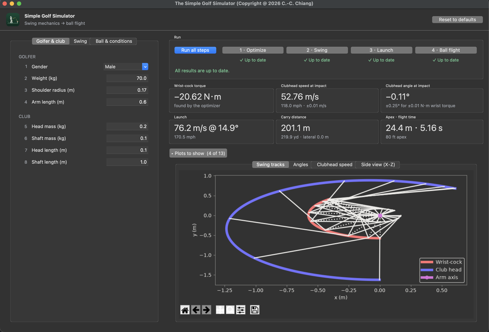

<p align="center">
  
</p>

# Simple Golf Simulator

A physics-based golf swing and ball trajectory simulator with an interactive GUI built using Tkinter and Matplotlib.

<p align="center">
  
</p>

The panel keeps the inputs on the left, grouped in three tabs, and the run steps, results and plots on the right. Values that a step computes -- the wrist-cock torque and the launch speed and elevation -- are marked *auto* and can also be typed in, which skips the step that would compute them.

## Requirements

- **Python 3.12+** is recommended for best compatibility
- Third-party packages: `matplotlib`, `numpy`
- Standard library: `tkinter`, `math`, `cmath`, `sys`

## Installation

With [uv](https://docs.astral.sh/uv/) (recommended), which installs Python 3.12 (including `tkinter`) and all dependencies into `.venv`:

```bash
uv sync
```

Or with pip:

```bash
pip install matplotlib numpy
```

With pip, on some Linux systems, `tkinter` may need to be installed separately:

```bash
# Debian/Ubuntu
sudo apt-get install python3-tk

# Fedora
sudo dnf install python3-tkinter
```

## Getting Started

```bash
uv run src/Main.py        # or: python src/Main.py
```

Click **Run all steps** to optimize the wrist torque, simulate the swing, compute the launch conditions and simulate the ball flight in one go; the results appear in cards next to the inputs, and the chosen plots are drawn in tabs below them. After you change an input, the affected results are marked stale until the next run, which re-runs only the steps that need it.

## Features

### Swing Simulation

The simulator models a two-degree-of-freedom golf swing using torque-driven angular mechanics. Users can configure:

- **Golfer parameters** -- gender, weight, shoulder radius, arm length
- **Club parameters** -- head/shaft mass and length
- **Swing conditions** -- swing plane angle, initial/impact arm angle, wrist-cock angle, swing type (Type I / Type II)
- **Torques** -- arm torque, wrist-cock torque (with automatic optimization)

Four numerical solution methods are available. Solution 4 (the default) is the classical 4th-order Runge-Kutta method; Solutions 1–3 are the original Runge-Kutta-based schemes, which are first-order accurate overall and are kept for comparison.

### Ball Trajectory

The ball flight model includes drag, lift, spin (Magnus effect), and wind. Configurable parameters:

- Ball mass, diameter, drag/lift coefficients
- Coefficient of restitution (COR)
- Air density, wind speed/direction
- Clubhead loft angle, launch angles, spin angles

### Plots

Plots are drawn in tabs inside the window, each with a toolbar to pan, zoom and save. Choose which ones to draw under **Plots to show**; only the visible tab is drawn, and in a dark desktop appearance the plots are drawn to match the window.

**Swing plots:**
Swing tracks, angles, angular velocities, angular accelerations, clubhead speed, torques, arm length, 1st and 2nd moments, and the wrist-torque search.

**Ball flight plots:**
Side view (X-Z), top view (X-Y), rear view (Y-Z), and the 3D flight path.

## Running Tests

```bash
uv run pytest
uv run ruff check .    # lint
```

The tests in `tests/` run the swing and ball-trajectory simulations headless and check the GUI's error messages without opening a window.

## Documentation

The full technical report (two-rod swing model, aerodynamic equations, simulation cases, and user's guide) is available as Sphinx documentation under `docs/`.

To build:

```bash
uv sync --group docs
cd docs
uv run --group docs sphinx-build -b html . _build/html
```

(Or with pip: `pip install sphinx sphinx-rtd-theme`, then run `sphinx-build` the same way.)

Then open `docs/_build/html/index.html` in your browser.

## Project Structure

| File | Description |
|------|-------------|
| `src/Main.py` | GUI application entry point |
| `src/BasicFunc.py` | Core swing physics |
| `src/BasicFunc2.py` | Ball trajectory physics |
| `src/AppFunc.py` | Swing simulation functions |
| `src/AppFunc2.py` | Ball trajectory simulation functions |
| `src/Plot.py` | Swing visualization |
| `src/Plot2.py` | Ball trajectory visualization |
| `src/Workflow.py` | Step states, stale results and results-card text for the panel |
| `src/UIFunc.py` | Shared input reading, error dialogs and plot handling |
| `examples/Case1.py` - `examples/Case10.py` | Standalone example cases, e.g. `uv run examples/Case1.py`; figures are saved as `.eps` in the current directory |
| `tests/` | pytest suite |
| `assets/` | Logo and screenshot |
| `pyproject.toml`, `uv.lock` | Dependencies (uv) |

## License

ISC License -- Copyright (c) 2026, Cheng-Chin Chiang
